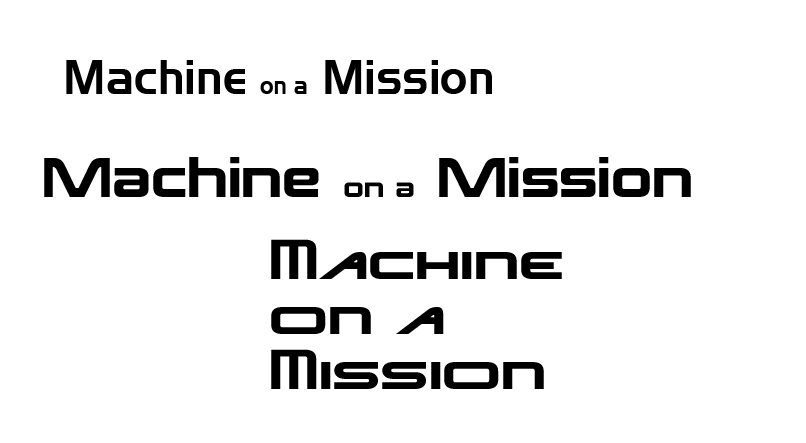
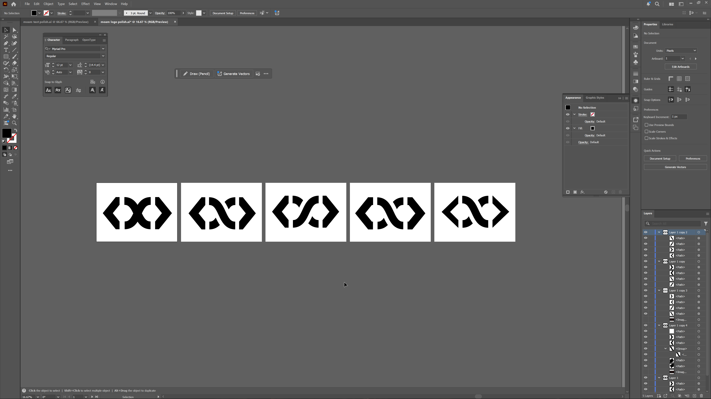
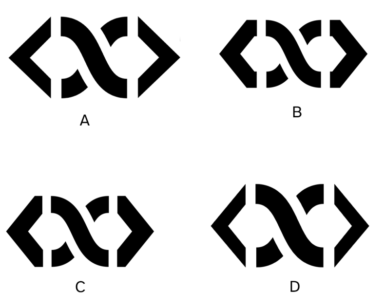
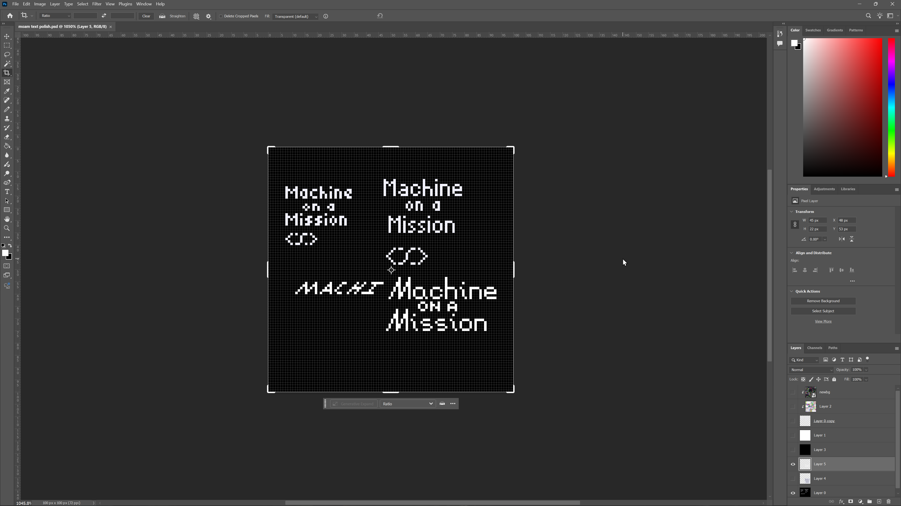
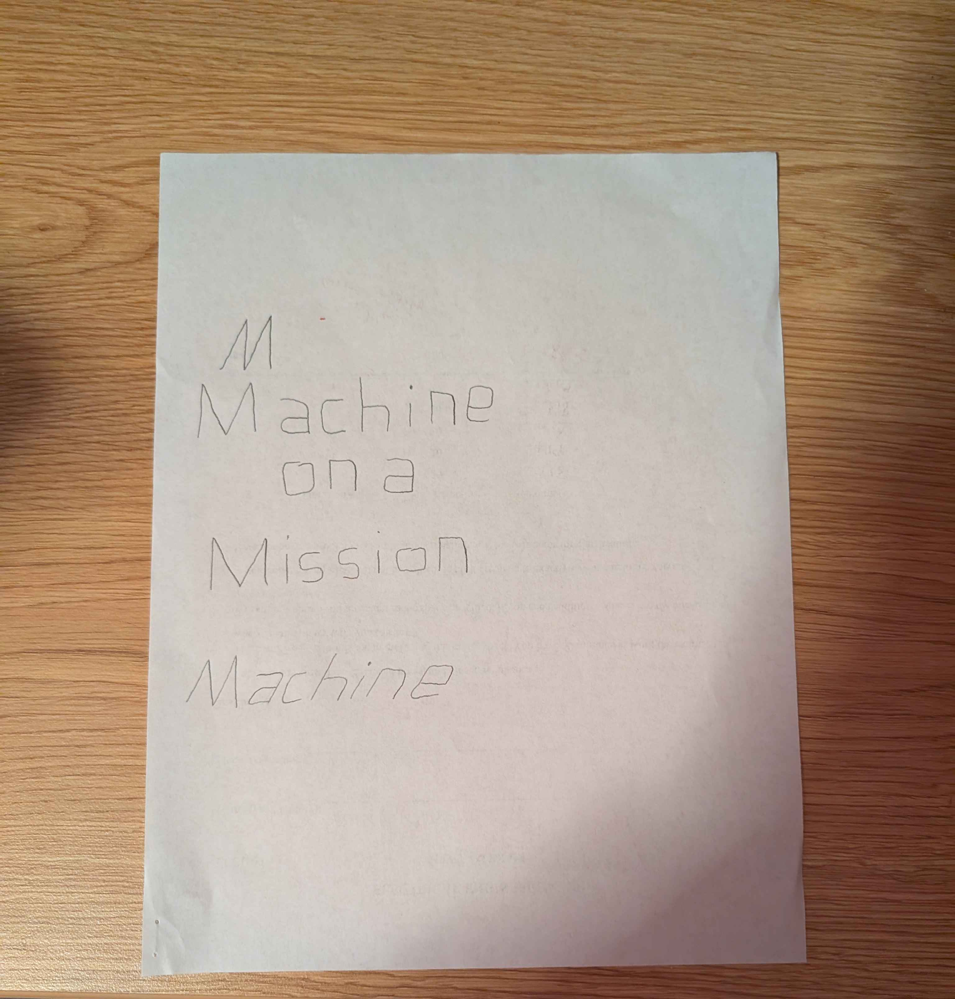

Always felt my logo was too thin, and the font too generic, so both got a redesign!

This iteration focused on bold and distinct strokes, and a fun display font I designed myself!

Old logo for comparison:

The logo was made in Adobe Illustrator, and the font was made myself, though with inspiration from several existing fonts:

bottom is nisejsrf, based off jet set radio

middle is mass effect 123 font, based off mass effect

top is "slider regular" which "fontmeme.com" said "is very similar" to the logo for Mass Effect

A random sampling of the iterations and things i tried designing this:

My first thought for the logo text was pixel art, but I didn't end up liking it.

